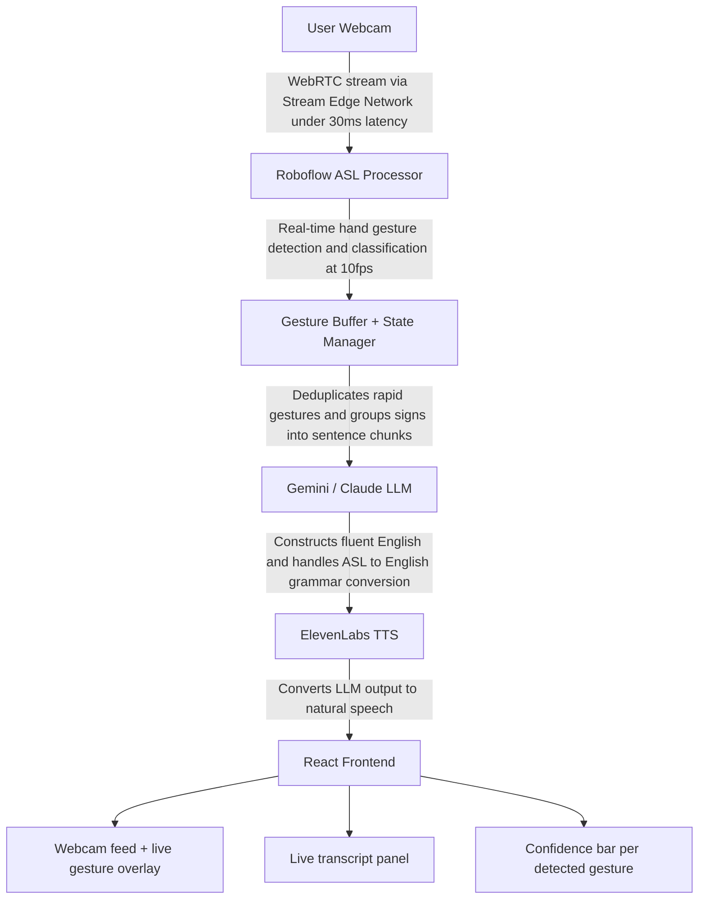

**🤟 SignSense AI**

Real-Time ASL Sign Language Interpreter

Vision Possible: Agent Protocol Hackathon • Feb 23 – Mar 1, 2026 • WeMakeDevs × Stream

|     |     |     |
| --- | --- | --- |
| **🥇 1st Place**<br><br>**$2,000** | **🥈 2nd Place**<br><br>**$1,500** | **📝 Best Blog**<br><br>**$500** |

# **1. Project Overview**

## **The Idea**

SignSense AI is a real-time ASL (American Sign Language) interpreter built on the Vision Agents SDK by Stream. A user signs into their webcam; the agent detects and classifies their hand gestures using a Roboflow ASL model in real-time, passes the gesture stream to an LLM (Claude or Gemini) to construct fluent English sentences, and speaks those sentences aloud via ElevenLabs TTS — giving a real-time voice to deaf and hard-of-hearing users.

|     |     |
| --- | --- |
| **💡** | Why this wins: Undeniable real-world impact (70M+ deaf users worldwide), creative use of the full Vision Agents stack (Roboflow + LLM + TTS), and meaningfully different from any existing SDK demo. |

## **How It Scores Against Judging Criteria**

| **Criterion** | **How SignSense Addresses It** | **Score** |
| --- | --- | --- |
| **Potential Impact** | Accessibility solution for 70M+ deaf/HoH people globally. Communication barrier elimination is a universal human need. | ⭐⭐⭐⭐⭐ |
| **Creativity & Innovation** | No existing demo in the repo covers ASL. Combining gesture detection with LLM-powered sentence construction is novel. | ⭐⭐⭐⭐⭐ |
| **Technical Excellence** | Multi-model pipeline: Roboflow (vision) → LLM (reasoning) → ElevenLabs (voice). Demonstrates mastery of the full SDK. | ⭐⭐⭐⭐⭐ |
| **Real-Time Performance** | Roboflow delivers <100ms inference. Stream's edge network provides <30ms audio latency. Genuinely real-time. | ⭐⭐⭐⭐ |
| **User Experience** | Simple webcam UI + voice output = zero learning curve. Anyone can demo it immediately. | ⭐⭐⭐⭐⭐ |
| **Best Use of Vision Agents** | Combines Roboflow processor + Gemini/Claude LLM + ElevenLabs TTS + Deepgram STT — uses every major SDK feature. | ⭐⭐⭐⭐⭐ |

# **2. Technical Architecture**

## **System Architecture Overview**



## **Technology Stack**

| **Layer** | **Technology** | **Purpose** |
| --- | --- | --- |
| **Video Transport** | Stream Edge (getstream.io) | WebRTC-based ultra-low-latency video delivery, <30ms |
| **Vision SDK** | Vision Agents (Python) | Core framework: processors, LLM integration, voice pipeline |
| **Gesture Detection** | Roboflow API / RF-DETR | Hosted ASL hand gesture classification model (pre-trained) |
| **LLM** | Google Gemini 2.0 Flash-Lite | Sign sequence → fluent English sentence construction |
| **Text-to-Speech** | ElevenLabs | Natural voice output for interpreted sentences |
| **Speech-to-Text** | Deepgram STT | Voice commands/queries from user (optional mode) |
| **Frontend** | React + Stream Video SDK | Webcam UI, gesture overlay, live transcript panel |
| **Runtime** | Python 3.12 + uv | Backend agent runtime |
| **Deployment** | Local dev + optional Docker | For demo, local is fine; Docker for polish |

# **3. Environment Setup (Day 1 Priority)**

## **Accounts to Create (Both Members)**

Create accounts on all of these services before writing a single line of code. Most have generous free tiers.

| **Service** | **URL** | **What You Need** |
| --- | --- | --- |
| **Stream (getstream.io)** | getstream.io/try-for-free | API Key + API Secret (333k free minutes) |
| **Roboflow** | roboflow.com | API Key for hosted model inference |
| **Google AI Studio** | aistudio.google.com | GOOGLE_API_KEY for Gemini |
| **ElevenLabs** | elevenlabs.io | API Key for TTS (free tier available) |
| **Deepgram** | deepgram.com | API Key for STT (free $200 credits) |
| **GitHub** | github.com | Star Vision-Agents repo (required for swag) |

## **Installation Commands**

Run these in your project directory (Python 3.12 required):

```bash
\# Install uv package manager (if not already installed)

curl -LsSf https://astral.sh/uv/install.sh | sh

\# Create project and install Vision Agents with all needed plugins

uv init signsense && cd signsense

uv add "vision-agents[getstream,gemini,elevenlabs,deepgram]" python-dotenv

\# Also install Roboflow inference SDK for gesture detection

uv add "roboflow" inference-sdk

\# Frontend: React app with Stream Video SDK

npx create-react-app signsense-frontend

cd signsense-frontend && npm install @stream-io/video-react-sdk
```

## **Environment Variables (.env file)**

```env
STREAM_API_KEY=your_stream_api_key

STREAM_API_SECRET=your_stream_api_secret

GOOGLE_API_KEY=your_gemini_key

ELEVENLABS_API_KEY=your_elevenlabs_key

DEEPGRAM_API_KEY=your_deepgram_key

ROBOFLOW_API_KEY=your_roboflow_key

ROBOFLOW_MODEL_ID=asl-hand-gesture-recognition/1 # or latest version
```

# **4. Full 6-Day Build Timeline**

|     |     |
| --- | --- |
| **⚠️** | Today (Feb 23) is Day 1. The deadline is March 1. You have 6 days. This plan is structured so that a working demo exists by Day 4, giving you 2 days to polish, record, and write the blog post. |

<div class="joplin-table-wrapper"><table><thead><tr><th><p><strong>Day</strong></p></th><th><p><strong>Focus</strong></p></th><th><p><strong>Tasks</strong></p></th><th><p><strong>Person A (Backend)</strong></p></th><th><p><strong>Person B (Frontend)</strong></p></th></tr></thead><tbody><tr><td><p><strong>Day 1</strong></p><p>Feb 23</p></td><td><p><strong>🔧 Setup &amp; Spike</strong></p></td><td><ul><li>Create all service accounts</li><li>Star Vision-Agents repo on GitHub</li><li>Set up Python env + install deps</li><li>Test Roboflow ASL model with a sample image</li><li>Get Stream API credentials working</li><li>Run the simple_agent example from Vision Agents docs</li></ul></td><td><p>Install Python env, run golf coach example</p></td><td><p>Install React + Stream Video SDK, get webcam feed showing</p></td></tr><tr><td><p><strong>Day 2</strong></p><p>Feb 24</p></td><td><p><strong>🧠 Core Agent</strong></p></td><td><ul><li>Build Roboflow gesture processor (custom VideoProcessor class)</li><li>Test gesture detection live with webcam</li><li>Wire processor output into Gemini LLM</li><li>Implement gesture buffer / debounce logic</li><li>Test end-to-end: sign letter → LLM interprets → text output</li></ul></td><td><p>Core agent + processor logic</p></td><td><p>Basic webcam component + gesture label overlay</p></td></tr><tr><td><p><strong>Day 3</strong></p><p>Feb 25</p></td><td><p><strong>🔗 Integration</strong></p></td><td><ul><li>Add ElevenLabs TTS for voice output</li><li>Refine LLM prompt for sign sequence → sentence construction</li><li>Handle edge cases: unknown gestures, low confidence scores</li><li>Connect backend to React frontend via Stream call</li><li>End-to-end flow working: sign → text + voice</li></ul></td><td><p>TTS + LLM prompt tuning</p></td><td><p>Frontend-backend connection + transcript panel</p></td></tr><tr><td><p><strong>Day 4</strong></p><p>Feb 26</p></td><td><p><strong>✨ Polish &amp; Features</strong></p></td><td><ul><li>Add confidence score display</li><li>Add conversation history / multi-turn support</li><li>Improve sentence construction quality with better prompting</li><li>Performance testing: latency measurements</li><li>Fix any bugs from Day 3 integration</li></ul></td><td><p>Perf + prompt tuning</p></td><td><p>UI polish: animations, colors, confidence bars</p></td></tr><tr><td><p><strong>Day 5</strong></p><p>Feb 27</p></td><td><p><strong>🎬 Demo &amp; Blog</strong></p></td><td><ul><li>Record demo video (5-10 min screen recording)</li><li>Write README.md for GitHub repo</li><li>Push clean code to public GitHub repository</li><li>Write blog post draft (see Section 7)</li><li>Social media post with demo clip + tag @VisionAgents</li></ul></td><td><p>README + code cleanup</p></td><td><p>Demo recording + social media post</p></td></tr><tr><td><p><strong>Day 6</strong></p><p>Feb 28 – Mar 1</p></td><td><p><strong>🚀 Submit</strong></p></td><td><ul><li>Final submission form (monitor hackathon Discord for link)</li><li>Publish blog post (dev.to or personal blog)</li><li>Respond to any judge questions</li><li>Final social media push</li><li>Buffer day for any last-minute fixes</li></ul></td><td><p>Submission + any last fixes</p></td><td><p>Blog post publish + social media</p></td></tr></tbody></table></div>

# **5. Codebase Structure**

## **Recommended Project Layout**

**signsense/**

```
├── backend/
│ ├── main.py # Agent entrypoint
│ ├── asl_processor.py # Custom Roboflow VideoProcessor
│ ├── gesture_buffer.py # Dedup + state management logic
│ ├── instructions.md # LLM system prompt
│ └── .env # API keys (never commit this!)
├── frontend/
│ ├── src/
│ │ ├── App.jsx # Main app + call setup
│ │ ├── VideoPanel.jsx # Webcam feed + overlays
│ │ ├── TranscriptPanel.jsx # Live text output
│ │ └── GestureOverlay.jsx # Gesture label + confidence bar
├── .gitignore # Exclude .env, __pycache__, node_modules
└── README.md # Demo video, setup instructions, screenshots
```

## **Core Agent Code (main.py)**

```python
from dotenv import load_dotenv
from vision_agents.core import Agent, AgentLauncher, User, Runner
from vision_agents.plugins import getstream, gemini, elevenlabs, deepgram
from asl_processor import ASLGestureProcessor

load_dotenv()

async def create_agent(**kwargs) -> Agent:
    return Agent(
        edge=getstream.Edge(),
        agent_user=User(name="SignSense AI", id="signsense-agent"),
        instructions="Read @instructions.md",
        llm=gemini.LLM("gemini-2.0-flash-lite"),
        tts=elevenlabs.TTS(),
        stt=deepgram.STT(),
        processors=[ASLGestureProcessor(fps=10)],
    )

if __name__ == "__main__":
    Runner(AgentLauncher(create_agent=create_agent)).cli()
```

## **LLM System Prompt (instructions.md)**

This prompt is what makes or breaks the quality of sentence construction. Copy and refine this:

You are SignSense AI — a real-time ASL interpreter.
The video processor will send you detected ASL gestures as a stream of
labeled signs, e.g.: [HELLO] [MY] [NAME] [JOHN]

**Your job:**

1. Translate the sign sequence into a natural English sentence.
2. Account for ASL grammar (topic-comment, no articles/copulas).
3. Be concise. Respond with ONLY the interpreted sentence.
4. If confidence is low or signs are ambiguous, say: [unclear]
5. Speak the sentence aloud via TTS immediately.

Keep responses natural and conversational. You are the voice of a deaf/HoH person communicating with hearing people.

# **6. Finding & Using the Roboflow ASL Model**

## **Step-by-Step: Getting the Model**

- Go to roboflow.com/universe and search for 'ASL hand gesture' or 'American Sign Language'
- Look for models with high mAP scores (aim for >80%) and recent training dates
- Recommended model: 'ASL Hand Gesture Recognition' — copy the model ID (e.g., asl-hand-gesture-recognition/1)
- Go to your Roboflow dashboard → Settings → API Keys → copy your API key

|     |     |
| --- | --- |
| **💡** | Roboflow's hosted inference API means you don't need a GPU locally. The model runs in their cloud and returns predictions via API. This is perfect for a hackathon. |

## **Custom ASL Processor Class (asl_processor.py)**

This is the heart of the technical implementation — a custom VideoProcessor that wraps the Roboflow API:
```py
from vision_agents.core.processors import VideoProcessor
from inference_sdk import InferenceHTTPClient
import os, time

class ASLGestureProcessor(VideoProcessor):
    def __init__(self, fps=10, confidence_threshold=0.6):
        self.client = InferenceHTTPClient(
        api_url="https://detect.roboflow.com",
        api_key=os.environ['ROBOFLOW_API_KEY']
    )

    self.model_id = os.environ['ROBOFLOW_MODEL_ID']
    self.threshold = confidence_threshold
    self.gesture_buffer = []
    self.last_gesture = None
    async def process(self, frame, **kwargs):
        result = self.client.infer(frame, model_id=self.model_id)
        if result['predictions']:
            top = max(result['predictions'], key=lambda p: p['confidence'])
        if top['confidence'] >= self.threshold:
            gesture = top['class']

        # Debounce: only add if different from last
        if gesture != self.last_gesture:
            self.gesture_buffer.append(gesture)
            self.last_gesture = gesture
            return {"gesture": gesture, "confidence": top['confidence']}

        return None

# **7. Blog Post Strategy ($500 Prize)**

|     |     |
| --- | --- |
| **💰** | The Best Blog Submission is a separate $500 prize. With 2 people, you can win both the main prize AND this — don't skip it. It takes 3-4 hours and is worth it. |

## **Blog Post Outline**

Publish on dev.to (recommended), Hashnode, or your personal blog. Target length: 1,500-2,000 words.

- Introduction (150 words): The problem — 70M+ deaf/HoH people face communication barriers daily. Your mission: bridge the gap with real-time AI.
- What is Vision Agents SDK? (200 words): Brief intro to Stream's open-source SDK, what makes it powerful (low latency, processor pipeline, multi-model support).
- The Architecture (400 words): Walk through your system diagram — Roboflow gesture detection → LLM sentence construction → ElevenLabs voice output. Include a diagram or ASCII art.
- Building the Gesture Processor (300 words): Code walkthrough of your ASLGestureProcessor class. Show the Roboflow integration, explain the confidence threshold and debounce logic.
- LLM Prompt Engineering (200 words): Show your instructions.md prompt, explain the ASL grammar → English grammar challenge, what prompt iterations you tried.
- Challenges & Learnings (300 words): Be honest about what was hard — gesture similarity confusion, latency tuning, the trigger-for-response limitation, etc. Judges love authenticity.
- Demo & Results (150 words): Embed your demo video, share latency numbers, show screenshots of the UI.
- What's Next (100 words): How you'd extend it — more signs, multi-language support, mobile app, custom model training.

## **Social Media Post Template**

Post this the day you publish your blog/demo, tagging @VisionAgents for the swag prize:

**Built a real-time ASL interpreter for the @WeMakeDevs Vision Possible Hackathon!**

🤟 Signs detected in real-time via @VisionAgents + Roboflow

🧠 Gemini constructs fluent English from sign sequences

🔊 ElevenLabs gives voice to the interpreted output

⚡ <30ms latency via Stream's edge network

_[attach demo video]_

#VisionPossible #WeMakeDevs #VisionAgents #AIForGood #Hackathon

# **8. Demo Video & Submission Requirements**

## **What to Show in Your Demo (5-10 minutes)**

- Open with the problem: briefly state what ASL is and why real-time interpretation matters (30 seconds)
- Show the architecture: a quick diagram slide or just narrate while pointing to the code (1 minute)
- Live demo: sign several phrases — 'Hello my name is...', 'I need help', 'Thank you' — show real-time text overlay AND voice output (3-4 minutes)
- Show latency: gesture detected → text appears → voice speaks. Should be under 2 seconds end-to-end (30 seconds)
- Show the React UI: the clean interface, confidence bars, transcript history (1 minute)
- Briefly mention the Vision Agents SDK features you used and why they mattered (1 minute)

## **Pre-Submission Checklist**

|     |     |
| --- | --- |
| ☐   | Code is on a public GitHub repository |
| ☐   | README.md includes: project description, demo video link/embed, setup instructions, architecture diagram, tech stack |
| ☐   | Demo video is recorded and uploaded (YouTube unlisted or Loom) |
| ☐   | .env.example file included (never commit real API keys!) |
| ☐   | Blog post published and URL ready |
| ☐   | GitHub Vision-Agents repo starred (you and your teammate) |
| ☐   | Social media post published tagging @VisionAgents |
| ☐   | Submission form filled out (monitor Discord for the link) |
| ☐   | Team name and member names confirmed for submission |

# **9. Risks & Mitigation**

| **Risk** | **Likelihood** | **Mitigation** |
| --- | --- | --- |
| **Roboflow ASL model has low accuracy for some signs** | Medium | Test on Day 1. Fallback: use Ultralytics YOLO + a custom ASL dataset from Roboflow Universe, or restrict demo to 10-15 high-confidence signs. |
| **Roboflow API rate limits hit during demo** | Low | Cache recent predictions. Roboflow free tier is generous. Pre-test with sustained inference. |
| **LLM constructs grammatically incorrect English** | Medium | Iterate on the system prompt. Show the raw sign labels alongside the interpreted sentence so judges can verify it's correct. |
| **Vision Agents SDK version breaks something** | Low | Pin to a specific version in pyproject.toml. Check the GitHub issues tab for known bugs before building. |
| **Stream API setup takes too long** | Low | Use their simple_agent example as a base. They have a Discord for real-time support during the hackathon. |
| **Team coordination bottleneck** | Medium | Clear task split (see timeline). Daily 15-min sync call. Use GitHub branches to avoid merge conflicts. |

# **10. Key Resources & Links**

| **Resource** | **URL** |
| --- | --- |
| **Hackathon Page** | wemakedevs.org/hackathons/vision |
| **Vision Agents GitHub** | github.com/GetStream/Vision-Agents |
| **Vision Agents Docs** | visionagents.ai |
| **Golf Coach Example (reference)** | github.com/GetStream/Vision-Agents/tree/main/examples/02_golf_coach_example |
| **Security Camera Example (reference)** | github.com/GetStream/Vision-Agents/tree/main/examples/05_security_camera_example |
| **Roboflow ASL Models** | universe.roboflow.com (search: ASL hand gesture) |
| **Stream Dashboard** | dashboard.getstream.io |
| **Vision Agents Discord** | discord.gg/RkhX9PxMS6 |
| **Roboflow Inference SDK Docs** | inference.roboflow.com |
| **ElevenLabs API Docs** | elevenlabs.io/docs |

**Good luck. You've got this. 🤟**

Vision Possible: Agent Protocol • Feb 23 – Mar 1, 2026